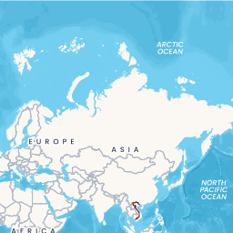

# Raster Tiles

**Mô tả**: Dịch vụ cung cấp bản đồ dạng raster theo các cấp độ thu phóng khác nhau, giúp hiển thị nhanh chóng trên web và mobile. Dữ liệu được cung cấp dưới dạng hình ảnh PNG.

**Phương thức**: `GET`

**URL**: `https://maps.ots.vn/api/v1/tiles/{type}/{z}/{x}/{y}.png`

**Tham số**:

| Tham số | Mô tả                                                                                   | Yêu cầu | Ví dụ   |
|---------|-----------------------------------------------------------------------------------------|:-------:|---------|
| `type`  | Giá trị bao gồm: `basic` - Cơ bản, `dark` - Đêm, `streets` - Đường phố, `light` - Sáng. |    ✅    | `basic` |
| `x`     | Ô trục X                                                                                |    ✅    | `0`     |
| `y`     | Ô trục Y                                                                                |    ✅    | `0`     |
| `z`     | Mức hiển thị                                                                            |    ✅    | `0`     |

**Ví dụ**:

```http
https://maps.ots.vn/api/v1/tiles/basic/0/0/0/png?apikey={YOUR_API_KEY}
```

**Response**:

Dịch vụ trả về ảnh kích thước 256x256




